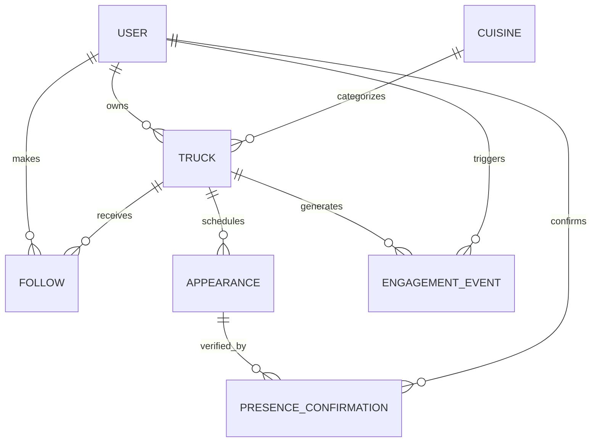

# Data Model

> The MVP data model and the design decisions behind it. Last updated: 2026-06-04.
> This is the design contract written *before* migrations. Field names/types are finalized in code, but the shape, relationships, and rationale here are the agreement. See [tech-stack.md](tech-stack.md) for the stack and [../design/roadmap.md](../design/roadmap.md) for feature phasing.

## Scope

Detailed models are the **MVP core** (the thin end-to-end slice). Phase 1+ entities are **sketched, not built**, to prove the core does not preclude them. See [Designed-for-later](#designed-for-later-sketched-not-built).

## Conventions

- **Base fields:** every model has `created_at` and `updated_at` (a shared `TimeStampedModel` abstract base).
- **Time:** `USE_TZ=True`; all datetimes are timezone-aware (stored UTC). Local-day logic ("open today") uses each truck's own timezone (see `Truck.timezone`).
- **Geo:** `PointField` uses SRID 4326 (WGS84 lat/lng), `geography=True`. Points are stored `(longitude, latitude)` order (see Gotchas).
- **Deletion:** prefer status fields over hard deletes where history matters (trucks, appearances).
- **Public URLs:** trucks use a `slug`, not the raw PK.

## Roles and Auth

### Strict role separation

An account is **either an owner or a customer**, never both (decision: clean permissions, no confusing dual-mode). `User.role` is set at signup.

- **Owner accounts** manage trucks and post appearances.
- **Customer accounts** discover, follow, and (later) earn loyalty.
- Accepted tradeoff: an owner cannot follow trucks as a customer with the same account. Revisit only if real demand appears.
- **Multi-person truck access** (staff/co-owners) is a *separate axis*, deferred via `TruckMembership` (see Designed-for-later). MVP = one `owner` per truck.

### Authentication

- Custom `User` with **email as the login identifier** (no username). Must exist before the first migration (`AUTH_USER_MODEL`).
- **API / mobile:** JWT via `djangorestframework-simplejwt` (access + refresh).
- **Web / HTMX:** Django session auth.
- Both `SessionAuthentication` and `JWTAuthentication` enabled in DRF defaults so one API serves both surfaces.

### Permissions matrix

| Action | Anonymous | Customer | Owner |
|---|:---:|:---:|:---:|
| Browse/discover trucks & appearances | yes | yes | yes |
| Follow a truck | no | yes | no |
| Create/edit a truck | no | no | own only |
| Post/edit an appearance | no | no | own truck |
| Confirm "I'm here now" | no | no | own truck |
| Crowd-confirm presence *(later)* | no | yes | n/a |

Object-level rule: an `IsTruckOwner` permission restricts truck/appearance writes to that truck's `owner`. Role-level rule: `OWNER` required to create trucks. Verification review (approve/reject) is a **staff/admin** action via Django admin, not part of the public role matrix.

## Core Models (MVP)

### User (custom)

`AbstractUser` subclass with `username` removed and email login (custom manager).

| Field | Type | Notes |
|---|---|---|
| `email` | EmailField, unique | `USERNAME_FIELD`. |
| `role` | CharField(choices: `OWNER`, `CUSTOMER`) | Strict, set at signup. |
| `display_name` | CharField | Public-facing name (owner contact / customer handle). |
| `is_active`, `is_staff` | bool | Django/admin standard. |
| `date_joined` | datetime | Standard. |

### Cuisine (lookup)

Drives discovery filtering **and** the cold-start fallback imagery (design-system tokens).

| Field | Type | Notes |
|---|---|---|
| `name` | CharField, unique | "Tacos", "BBQ", "Coffee". |
| `slug` | SlugField, unique | For filter URLs. |
| `icon` | CharField | Icon token (maps to the icon set). |
| `color` | CharField | Hex for the no-photo fallback block. |
| `is_active` | bool | Hide without deleting. |

### Truck

| Field | Type | Notes |
|---|---|---|
| `owner` | FK -> User (`PROTECT`) | The managing owner account. |
| `name` | CharField | Truck name. |
| `slug` | SlugField, unique | Public URL. |
| `cuisine` | FK -> Cuisine (`PROTECT`, null=True) | Primary cuisine; drives filter + fallback. |
| `description` | TextField | Short bio. |
| `logo` | ImageField, null | Optional (fallback if absent). |
| `hero_image` | ImageField, null | Optional. |
| `timezone` | CharField (IANA, e.g. `America/Chicago`) | Local-day logic for schedules. |
| `website`, `phone`, `instagram` | CharField, blank | Optional contact. |
| `accepts_catering_inquiries` | bool, default False | The catering *connector* hook (a flag, never a booking system). |
| `status` | CharField(`DRAFT`, `ACTIVE`, `PAUSED`) | Owner-controlled visibility. |
| `verification_status` | CharField(`UNVERIFIED`, `PENDING`, `VERIFIED`, `REJECTED`) | The trust gate. Public discovery requires `VERIFIED`. See [owner-verification](../features/owner-verification.md). |

### TruckVerification

The audit trail for the owner-verification flow (see [owner-verification.md](../features/owner-verification.md)). One row per submission/decision. Reviewed in Django admin for the MVP.

| Field | Type | Notes |
|---|---|---|
| `truck` | FK -> Truck (`CASCADE`) | |
| `method` | CharField(`PERMIT`, `SOCIAL`, `LIVE_PHOTO`, `CALL`) | The signal provided (also records the verification *tier*). |
| `evidence` | ImageField / TextField | Submitted proof. **Sensitive PII**: store private, access-restricted, retention-limited. |
| `status` | CharField(`PENDING`, `APPROVED`, `REJECTED`) | |
| `reviewer` | FK -> User (`SET_NULL`, null) | Staff who decided. |
| `notes` | TextField, blank | Reviewer notes / rejection reason. |

On `APPROVED`, set the parent `Truck.verification_status = VERIFIED`. A successful dispute can revert a truck to `PENDING`.

### Appearance (the spine)

A truck at a place over a time window. One row per occurrence (discrete; recurrence is later).

| Field | Type | Notes |
|---|---|---|
| `truck` | FK -> Truck (`CASCADE`) | |
| `location` | PointField (4326, geography) | Indexed (GiST) for "near me". |
| `address` | CharField | The geocoded source address. |
| `location_name` | CharField, blank | Friendly label ("Mueller Lake Park"). |
| `coordinates_confirmed` | bool, default False | Owner dragged/confirmed the pin (accuracy). |
| `start_at` | datetime | Window start. |
| `end_at` | datetime | Window end. |
| `status` | CharField(`SCHEDULED`, `CANCELED`) | Lifecycle. "Live now" is *derived*, not stored. |
| `last_confirmed_at` | datetime, null | Denormalized from the latest owner confirmation (cheap "verified here" reads). |

**Coordinates** come from the geocoding wrapper on save, then the owner confirms the pin. We never geocode on read. **"Live / here now"** is derived: the window contains `now`, elevated to "verified here" when `last_confirmed_at` is recent. Indexes: GiST(`location`), (`truck`, `start_at`), (`start_at`, `end_at`).

### PresenceConfirmation

The confirmation *log*. MVP records owner "I'm here now"; the same table extends to crowd-confirmation and is the substrate trust rank derives from.

| Field | Type | Notes |
|---|---|---|
| `appearance` | FK -> Appearance (`CASCADE`) | |
| `confirmed_by` | FK -> User (`SET_NULL`, null) | Owner now; customer later. |
| `source` | CharField(`OWNER`, `CUSTOMER`) | MVP: `OWNER` only. |
| `kind` | CharField(`HERE_NOW`, `NOT_HERE`) | MVP: `HERE_NOW` only. `NOT_HERE` is crowd-confirm later. |
| `point` | PointField, null | Where the confirmer was (owner's actual position). |

On an owner `HERE_NOW` create, update the parent `Appearance.last_confirmed_at`.

### Follow (community graph)

| Field | Type | Notes |
|---|---|---|
| `customer` | FK -> User (`CASCADE`) | Must be a CUSTOMER account. |
| `truck` | FK -> Truck (`CASCADE`) | |
| `created_at` | datetime | |

Constraint: `unique_together(customer, truck)`.

### EngagementEvent (analytics substrate)

Cheap-now logging that powers later analytics, trust signals, and monetization proof. Append-only.

| Field | Type | Notes |
|---|---|---|
| `user` | FK -> User (`SET_NULL`, null) | Null for anonymous browsers. |
| `device_id` | CharField, blank | Anonymous identification (not tied to identity). |
| `truck` | FK -> Truck (`SET_NULL`, null) | Most events reference a truck. |
| `appearance` | FK -> Appearance (`SET_NULL`, null) | When relevant. |
| `event_type` | CharField(choices) | `TRUCK_VIEW`, `PROFILE_VIEW`, `SEARCH`, `DIRECTIONS_TAP`, `FOLLOW`, `UNFOLLOW`, `APPEARANCE_VIEW`. |
| `metadata` | JSONField, default dict | Event-specific context (search terms, radius, etc.). |

Indexes: (`truck`, `event_type`, `created_at`), (`created_at`). See Gotchas for the growth/rollup plan.

## Relationships



## Geo and Discovery

The "near me" query is the spine. Example (GeoDjango):

```python
from django.contrib.gis.geos import Point
from django.contrib.gis.measure import D
from django.contrib.gis.db.models.functions import Distance

user_point = Point(lng, lat, srid=4326)  # note: (lng, lat) order
Appearance.objects.filter(
    status="SCHEDULED",
    end_at__gte=now,
    location__dwithin=(user_point, D(km=5)),
).annotate(distance=Distance("location", user_point)).order_by("distance")
```

`dwithin` uses the GiST index for fast radius filtering; `Distance` annotates exact distance for sorting/display. "Open now / soon" layers a time-window filter on top. **Public discovery additionally filters to trucks with `status = ACTIVE` and `verification_status = VERIFIED`** (the verification gate; see [owner-verification.md](../features/owner-verification.md)).

## Designed-for-later (sketched, not built)

Each hangs off existing core fields so it is an additive migration, not a rework:

| Entity | Shape | Hangs off |
|---|---|---|
| `TruckMembership` | (truck, user, role: OWNER/MANAGER/STAFF) for multi-person access | replaces the single `Truck.owner` read path |
| `SignatureDish` | (truck, name, description, photo, position); max 3 enforced in app | `Truck` |
| `Rating` | (truck, customer, value/recommend); gated to verified visits | `Truck` + `PresenceConfirmation` |
| `TrustRank` | derived tier from confirmation history + tenure + accuracy | `PresenceConfirmation`, `Appearance` |
| `LoyaltyProgram` / `StampCard` / `Stamp` | scan-at-window punch card; owner sets reward | `Truck`, `User` |
| `LiveLocationPing` | (truck, point, recorded_at) periodic GPS while "live" | `Truck` (point + time pattern already established) |
| `CateringInquiry` | (truck, contact, message); a connector handoff, never a brokerage | `Truck.accepts_catering_inquiries` |
| `SavedLocation` | owner's reusable spots (geocode once, reuse) | `Truck`, `Appearance` |
| `RecurringSchedule` | template that generates `Appearance` rows | `Appearance` |
| `Market` / `Region` | geographic dimension for multi-city (per-city liquidity metrics, future partitioning seam) | `Truck`, `Appearance.location` |
| `PushToken` | (user, token, platform) device tokens for push | `User` |
| `NotificationPreference` | per-user channel/type toggles | `User` |
| `Subscription` | (owner, plan, status, Stripe ids) for SaaS billing | `Truck` / `User` |

## Migration / build order

1. **Custom `User`** and set `AUTH_USER_MODEL` (before the first migration; non-negotiable ordering).
2. `Cuisine`.
3. `Truck`.
4. `TruckVerification`.
5. `Appearance`.
6. `PresenceConfirmation`.
7. `Follow`.
8. `EngagementEvent`.

## Gotchas and Pitfalls

- **Custom user model must precede the first migration.** Retrofitting it is a painful migration. This is step 1.
- **Point coordinate order is `(lng, lat)`.** GeoDjango/PostGIS expect x=longitude, y=latitude. Swapping them silently puts trucks in the wrong hemisphere.
- **`EngagementEvent` grows fast.** It is append-only and high-volume. Index it (above), never build dashboards by scanning it raw at scale; roll up into periodic aggregates when analytics ships (Phase 1).
- **Timezones:** store UTC, but a truck's schedule is *local*. Use `Truck.timezone` for "today/open now" logic, or a schedule in Austin looks wrong to a viewer elsewhere.
- **Geocode on write, not read.** Coordinates are resolved via the wrapper when an appearance is saved and confirmed by the owner's pin; reads use the stored point (zero geocoding cost).
- **"Live now" is derived, not a stored status.** Compute from the time window + recent `last_confirmed_at`; do not add a mutable "is_live" boolean that can drift.
- **Strict role separation is intentional.** Owners cannot follow as customers. If product demand changes this, it is a deliberate revisit, not a bug.
- **Don't hard-delete trucks/appearances** with engagement or confirmation history; use `status`.
- **Privacy:** keep PII out of `EngagementEvent`; the anonymous `device_id` must not be linkable to a real identity.
